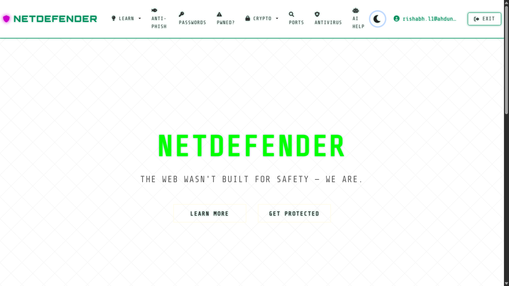

# 🛡️ NetDefender - **The Web Wasn’t Built for Safety — We Are.**



NetDefender is a web-based cybersecurity platform that offers real-time protection against online threats. It features advanced file, folder, and URL scanning with AI-powered malware detection via Gemini and integrated antivirus support through ClamAV.

With end-to-end encryption, secure file sharing, and breach monitoring via the Have I Been Pwned API, NetDefender ensures your data stays protected and your credentials stay safe.
## 🚀 Features

**NetDefender** integrates advanced technologies to deliver a multi-layered cybersecurity defense system:

- 🛡 **Real-Time Antivirus Scanning**  
  Scan files and folders using the open-source **ClamAV** engine to detect and eliminate malware threats instantly.

- 🤖 **AI-Powered Security Bot**  
  An intelligent **Gemini-powered chatbot** that assists users by identifying suspicious behavior, answering security-related queries, and guiding them through threat analysis.

- 🔐 **File Encryption & Decryption with Secure Sharing**  
  Protect your data with **end-to-end encryption and decryption**, and securely share files via **WhatsApp** and **Email**, including automatic key transfer for secure delivery.

- 🕵️ **Data Breach Monitoring**  
  Stay informed with real-time alerts using the **Have I Been Pwned API** to detect if your credentials have been compromised in known breaches.

- 🔗 **Phishing & URL Scanner**  
  Automatically scan URLs to detect phishing attempts and malicious links, enhancing your browsing safety.

- 📦 **Easy Deployment & Intuitive UI**  
  Simple setup process with a clean, user-friendly interface—ideal for both beginners and professionals.

## 🧰 Tech Stack

| Layer        | Technology                         |
|--------------|------------------------------------|
| Frontend     | HTML, CSS, JavaScript              |
| Backend      | Flask                              |
| Antivirus    | ClamAV                             |
| AI Engine    | Gemini API                         |
| Security APIs| HaveIBeenPwned, VirusTotal         |
| Encryption Decryption   | AES / 3DES / RSA with Key Sharing|

## ⚙️ Installation & Deployment

Follow the steps below to set up and run **NetDefender** locally on your machine.

 1️⃣ Clone the Repository
```bash
git clone https://github.com/0xrishabhh/NetDefender.git
cd netdefender
```
2️⃣ Install Dependencies
```bash
pip install -r requirements.txt
```
3️⃣ Configuration 

```bash
for .env
GOOGLE_CLIENT_ID= Your_Client_ID
GOOGLE_CLIENT_SECRET= Your_Client_secret

for chatbot.py
API_KEY = "YOUR_GEMINI_API_KEY"

for config.py
# Directory to monitor for new files
WATCH_FOLDER = "C:/YOUR_PATH"

# Path to ClamAV scan command
CLAMSCAN_PATH = "C:/YOUR_PATH/ClamAV/clamscan.exe"

for models.py
# Admin email configuration
ADMIN_EMAIL = "admin@..."
SYSTEM_EMAIL = "your mail"

for utils.py
EMAIL_HOST = 'smtp.gmail.com'
EMAIL_PORT = 465  # Using SSL port instead of TLS
EMAIL_USER = ''
EMAIL_PASSWORD = 'abcd efgh ijkl mnop'  # Google App Password
```
4️⃣ Run the Application
```bash
python app.py
```
🌐 Access the App
```
http://127.0.0.1:8080/
```
